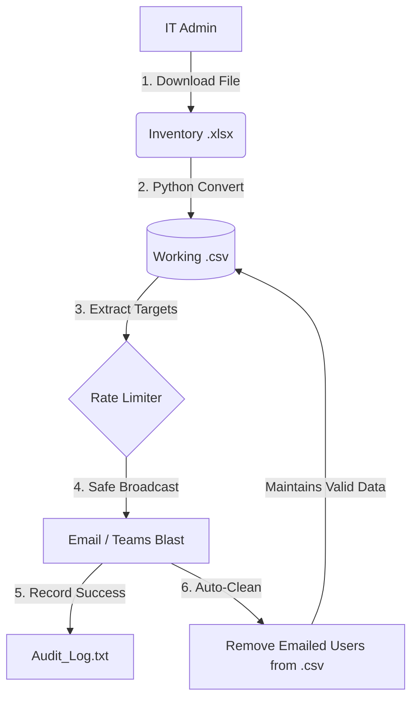

<h1 align="center">Enterprise IT Asset Audit Automation 🛠️</h1>

<p align="center">
  
  
  
</p>

## 📌 Overview
An enterprise-grade Python automation script designed to streamline the IT Asset Auditing process. This tool automatically identifies employees with untagged hardware (laptops/peripherals) and orchestrates targeted notification blasts via Microsoft Teams and Outlook, drastically reducing manual tracking hours.

*Note: This is a sanitized/dummy version of an internal corporate script to demonstrate the logic and Email integrations without exposing any proprietary company data.*

## 🏗️ Architecture Flow



## ✨ Key Features
- **Automated Processing:** Automatically converts raw `.xlsx` inventory files into processable `.csv` formats.
- **Smart Rate Limiting:** Implements sleep intervals to prevent system bottlenecks during targeted email/Teams blasts.
- **Self-Cleaning Data:** Once a blast is successful, the script auto-removes the user from the `.csv` file, ensuring the dataset only retains pending/valid targets!
- **Continuous Auditing:** Generates reliable local logs post-execution for immediate accountability.

## 🚀 How It Works
1. The script ingests the raw downloaded `.xlsx` inventory file.
2. It flawlessly converts the `.xlsx` into a working `.csv` file for rapid data extraction.
3. Iterates through the target list in controlled batches (Rate Limiting).
4. Dispatches the notification blasts via Email.
5. Logs the successful transmission and **immediately removes the processed user** from the `.csv`.
6. Leaves behind a perfectly scrubbed `.csv` containing only untouched data for the next run.

## 🛠️ Setup & Installation
```bash
# Clone the repository
git clone https://github.com/YourUsername/it-asset-automation.git

# Navigate to the directory
cd it-asset-automation

# Install required dependencies
pip install -r requirements.txt
```

## 🔐 Environment Variables
You will need to set up an Azure App Registration with the necessary permissions (`Mail.Send`, `Chat.Create`) and create a `.env` file:
```env
CLIENT_ID=your_dummy_client_id
CLIENT_SECRET=your_dummy_client_secret
TENANT_ID=your_dummy_tenant_id
```

## 🤝 Contributing
Feel free to fork this project and submit PRs if you have ideas on expanding the automation to other IAM tools!
